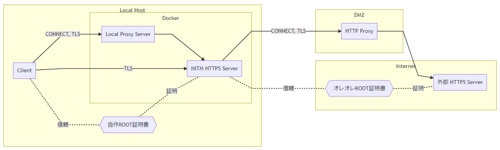

# MITM HTTPS Server
他者の発行したオレオレROOT証明書を信頼しないと安全に通信できない `外部 HTTPS Server` がある場合に、
許可外のサーバーの通信内容を盗聴・改ざんされないようにする


## 特徴
- 他者の発行したROOT証明書の影響範囲を制限する
    - ※ OS組み込みのROOT証明書以外
    - 自分で発行したROOT証明書だけを信頼すれば良くなる
- HTTPプロキシサーバー(DMZ)でTLSが復号されている場合にも対応


## 仕組み

[
    
](./docs/images/structure.md)

</details>

1. `Clientアプリ（ブラウザなど）` は対象のドメイン名の名前解決要求を出す
    - ※ 事前にプロキシの例外に追加しプロキシサーバーが使われないようにしておく
1. hosts がローカルの `MITM HTTPS Server` の IPに名前解決する
    - ローカルのIP
        - 設定キー: `FORWARDING_SERVER_BIND_IP`
        - 例: `127.9.9.9`
    - ※ 事前にhosts ファイルで書き換え対象のドメイン名をローカルのIPに名前解決されるようにしておく
1. `Clientアプリ` は名前解決で得られたローカルのIPの443番ポート ( `MITM HTTPS Server` ) にHTTPSリクエスト
1. `Clientアプリ` - `MITM HTTPS Server` 間でTLS接続が成功
    - ※ 事前に `MITM HTTPS Server` のROOT証明書を信頼するようにしておく
1. `MITM HTTPS Server` はプロキシが処理可能なリクエストに変換してからプロキシサーバーへリクエスト
    - Host Header から実際の接続先FQDNを取得しプロキシサーバーへCONNECTリクエスト
1. プロキシサーバーが代理で `外部 HTTPS Server` とTCP接続
1. `MITM HTTPS Server` - `外部 HTTPS Server` 間でTLS接続が成功
    - ※ 事前に `MITM HTTPS Server` 内でのみ `外部 HTTPS Server` のROOT証明書を信頼するようにしておく
        - `.env` の `root_cert_file_name` 設定
1. `Clientアプリ` - `外部 HTTPS Server` 間でHTTP通信


## 使い方

### 事前準備 (初回のみ)
1. [docker, docker-compose をインストール](https://docs.docker.com/install/#supported-platforms)
1. ROOT証明書を作成
    ```sh
    ./generate-root-key.sh
    ```
    - 引数1: `ROOT_CERT_COMMON_NAME`
        - ROOT証明書の「発行先」・「発行者」
        - 任意 (デフォルトは `"Private CA"` )
    - 引数2: `ROOT_CERT_LIFETIME_DAYS`
        - ROOT証明書の「有効期限」 (単位: 日)
        - 任意 (デフォルトは `30` )
1. 生成した ROOT証明書 `./.generated/root.crt` を信頼
    - 証明書を開いて `信頼されたルート証明機関` にインストールする
1. 信頼する必要のある「他者の発行したROOT証明書」を `./.provided-root-ca` に配置する
    - ファイル名は `.env` で指定するため自由
    
### 設定 & 起動 (初回 & 対象ドメインの変更時)
1. 設定
    1. 設定ファイルを作成: `.env.example` を `.env` にコピー（既に存在するならばスキップ）
        ```sh
        cp --no-clobber .env.example .env
        ```
    1. 設定ファイル `.env` を必要に応じて編集
        - ※ Docker Machine を使っている場合は、`FORWARDING_SERVER_BIND_IP` には `127.0.0.0/8` のIPではなく、 `docker-machine ip` で得られるIPを設定する必要がある
            ```
            $ docker-machine ip
            192.168.99.100
            ```
1. hosts ファイルを変更
    - 対象ドメイン ( `.env` の `TARGET_DOMAINS` に書いたドメイン) が `FORWARDING_SERVER_BIND_IP` で指定したIPに名前解決されるようにする
        ```
        127.9.9.9			example.com example.net
        ```
    - Windowsの場合
        ```
        C:\Windows\System32\drivers\etc
        ```
        - ※ Windowsの場合、1行のエイリアスの最大数は `8` である点に注意
            - 参考: [HOSTS ファイルにおけるエイリアス名の最大数について](https://support.microsoft.com/ja-jp/help/2717022)
1. 対象ドメインをプロキシの例外に追加（プロキシサーバーを使わないようにする）
    - ローカルの hosts を使用して名前解決されるようにしてDockerコンテナ内の `MITM HTTPS Server` にリクエストが飛ぶようにする必要があるため
1. `MITM HTTPS Server` を起動
    ```sh
    docker-compose up --build -d
    ```


## 制約
- HTTPプロキシサーバー経由で `外部 HTTPS Server` にアクセスしていること
- FQDN（≒ドメイン名）での通信であること
    - IPアドレスでの通信は名前解決がされなく通信に割り込めないため非対応
- リクエスト中に元のリクエスト先FQDNが含まれていること
    - Host ヘッダーが存在すること
- ポート番号はプロトコルのデフォルトであること
    - HTTPS リクエスト: `443`
