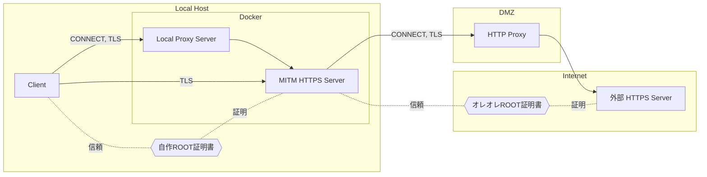

```mermaid
graph LR
    subgraph "Local Host"
        client[Client]
        local_root_cert{{自作ROOT証明書}}
        subgraph Docker
            local_mitm_server[MITM HTTPS Server]
            local_proxy[Local Proxy Server]
        end
    end
    subgraph DMZ
        proxy[HTTP Proxy]
    end
    subgraph Internet
        external_root_cert{{オレオレROOT証明書}}
        external_server[外部 HTTPS Server]
    end

    client -->|CONNECT, TLS| local_proxy
    local_proxy --> local_mitm_server

    client -->|TLS| local_mitm_server
    client -.-|信頼| local_root_cert
    local_root_cert -.-|証明| local_mitm_server

    local_mitm_server -->|CONNECT, TLS| proxy
    proxy --> external_server
    local_mitm_server -.-|信頼| external_root_cert
    external_root_cert -.-|証明| external_server
```
